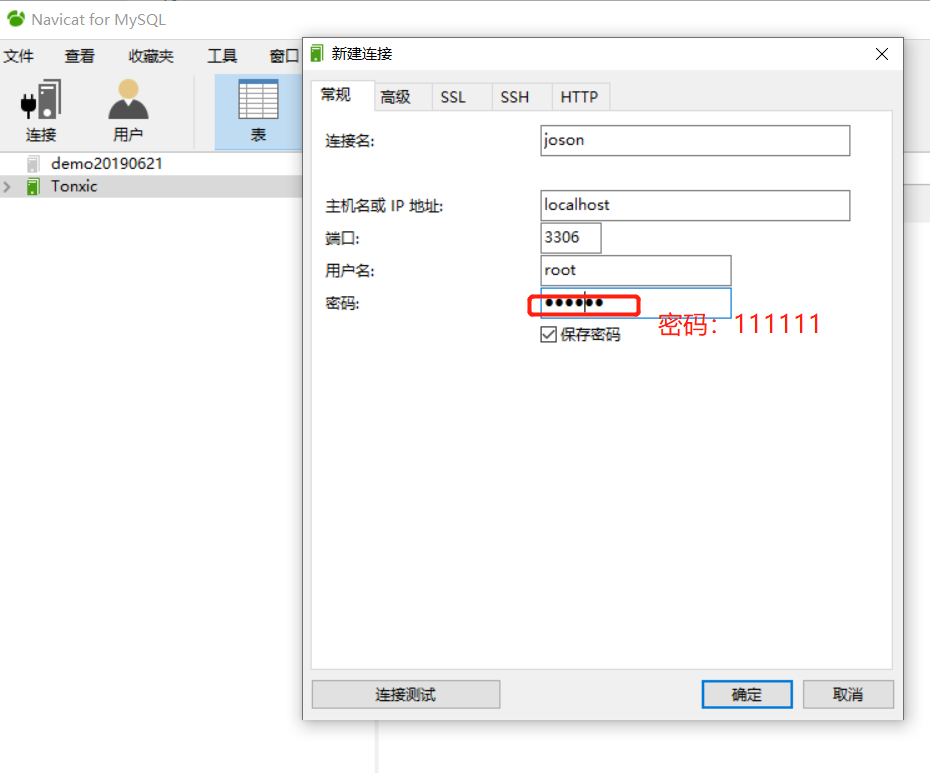
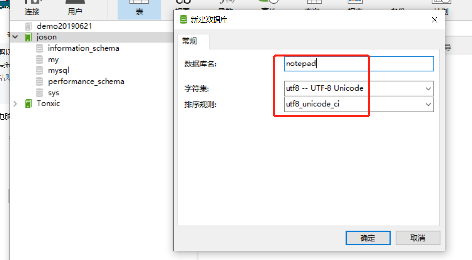
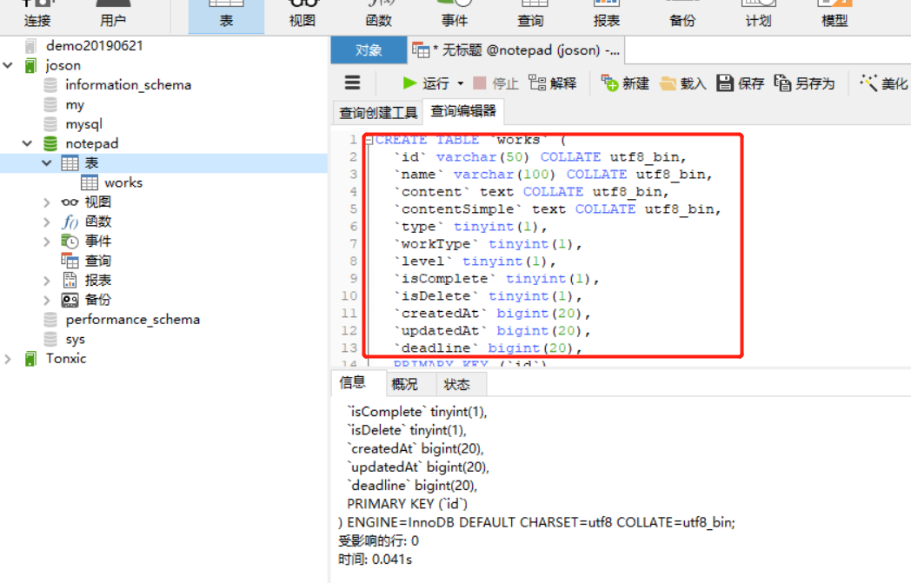

# notepad
记事本项目：vue+node.js(koa2+mysql)前端后分离


### 运行后端（back-end）:

```shell
npm i
```
 
```shell
node app.js
```
 
 <br/>
 
### 数据库
参考`notepad\back-end\init\sequelize.js`目录新建数据库
```javascript
var config = {
  database: 'notepad',
  username: 'root',
  password: '111111',
  host: 'localhost',
  port: 3306
};

module.exports = config;
```

新建连接


新建数据库


新建表



notepad\back-end\init.txt（使用这里的代码新建查询创建表）

<br/>

### 运行前端（front-end）
 
```shell
npm i
```

```shell
npm run dev
```
 
#### 最后http://localhost:8080/打开
 
